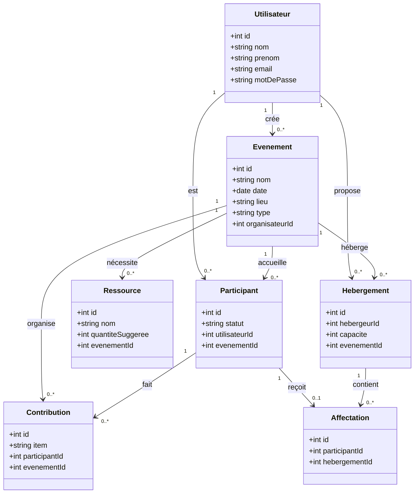

```mermaid
classDiagram
    class Utilisateur {
        +int id
        +string nom
        +string prenom
        +string email
        +string motDePasse
    }

    class Evenement {
        +int id
        +string nom
        +date date
        +string lieu
        +string type
        +int organisateurId
    }

    class Participant {
        +int id
        +string statut
        +int utilisateurId
        +int evenementId
    }

    class Ressource {
        +int id
        +string nom
        +int quantiteSuggeree
        +int evenementId
    }

    class Contribution {
        +int id
        +string item
        +int participantId
        +int evenementId
    }

    class Hebergement {
        +int id
        +int hebergeurId
        +int capacite
        +int evenementId
    }

    class Affectation {
        +int id
        +int participantId
        +int hebergementId
    }

    Utilisateur "1" --> "0..*" Evenement : crée
    Utilisateur "1" --> "0..*" Participant : est
    Utilisateur "1" --> "0..*" Hebergement : propose

    Evenement "1" --> "0..*" Participant : accueille
    Evenement "1" --> "0..*" Ressource : nécessite
    Evenement "1" --> "0..*" Contribution : organise
    Evenement "1" --> "0..*" Hebergement : héberge

    Participant "1" --> "0..*" Contribution : fait
    Participant "1" --> "0..1" Affectation : reçoit

    Hebergement "1" --> "0..*" Affectation : contient
```
