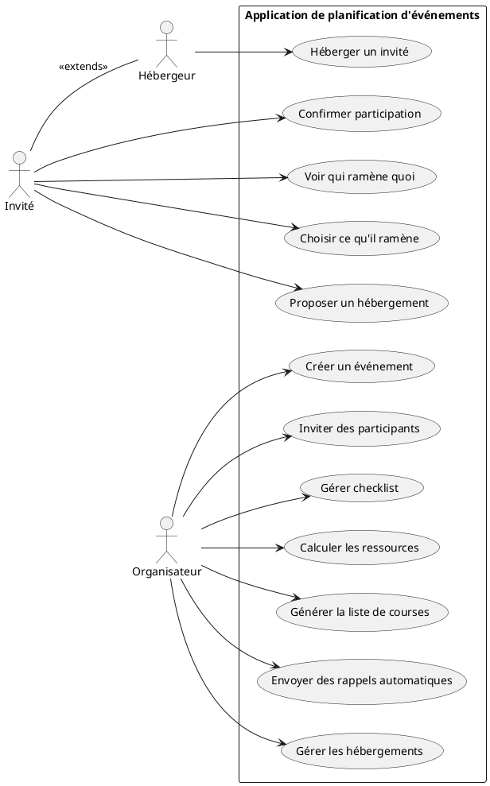
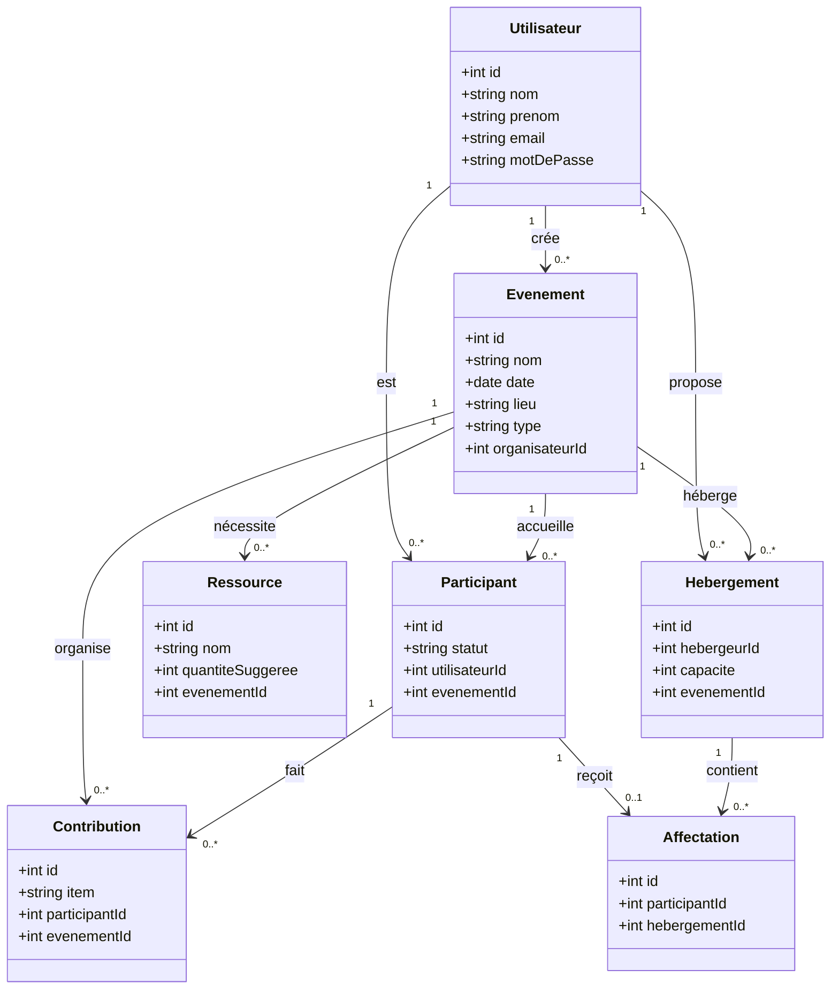
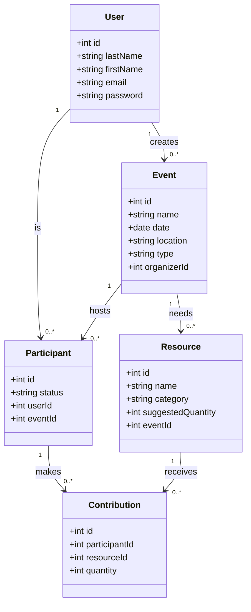
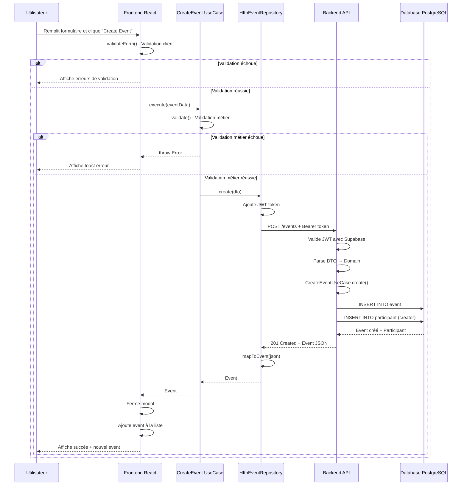
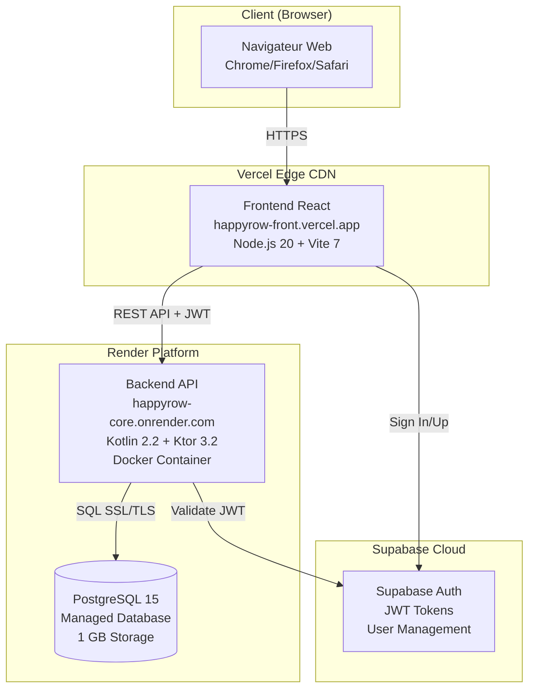

# ANNEXE A - DIAGRAMMES UML ET MODÉLISATION

## A.1 Diagramme de cas d'utilisation

### A.1.1 Vue d'ensemble des acteurs et cas d'usage

**Acteurs identifiés** :

- **Organisateur** : Créateur et gestionnaire d'événements
- **Invité/Participant** : Personne invitée à un événement
- **Hébergeur** : Invité proposant un hébergement (extension de Invité)

**Diagramme PlantUML** :



**Périmètre MVP (implémenté)** :

- ✅ UC1 : Créer un événement
- ✅ UC2 : Inviter des participants (ajout manuel)
- ✅ UC8 : Confirmer participation (statut)
- ✅ UC9 : Voir qui ramène quoi (contributions)
- ✅ UC10 : Choisir ce qu'il ramène (contributions)

**Périmètre futur (v2)** :

- 🔄 UC3 : Gérer checklist
- 🔄 UC4 : Calculer les ressources (quantités suggérées)
- 🔄 UC5 : Générer la liste de courses
- 🔄 UC6 : Envoyer des rappels automatiques
- 🔄 UC7, UC11, UC12 : Gestion des hébergements

---

## A.2 Diagramme de classes

### A.2.1 Modèle de domaine complet

**Diagramme Mermaid** :



### A.2.2 Modèle simplifié MVP (implémenté)



**Cardinalités** :

- Un User crée plusieurs Events (1:N)
- Un User peut être Participant à plusieurs Events (1:N)
- Un Event a plusieurs Participants (1:N)
- Un Event nécessite plusieurs Resources (1:N)
- Un Participant fait plusieurs Contributions (1:N)
- Une Resource reçoit plusieurs Contributions (1:N)

---

## A.3 Modèle Conceptuel de Données (MCD)

### A.3.1 Entités et attributs

#### Entité User

- **id** : Identifiant unique (UUID côté backend, géré par Supabase Auth)
- **lastName** : Nom de famille
- **firstName** : Prénom
- **email** : Email (unique, utilisé pour authentification)
- **password** : Mot de passe (haché, géré par Supabase)

#### Entité Event

- **id** : Identifiant unique (UUID)
- **name** : Nom de l'événement (unique)
- **date** : Date et heure de l'événement
- **location** : Lieu de l'événement
- **type** : Type (PARTY, BIRTHDAY, DINER, SNACK)
- **organizerId** : Référence vers User (créateur)

#### Entité Participant

- **id** : Identifiant unique (UUID)
- **status** : Statut (CONFIRMED, PENDING, DECLINED)
- **userId** : Référence vers User
- **eventId** : Référence vers Event

#### Entité Resource

- **id** : Identifiant unique (UUID)
- **name** : Nom de la ressource
- **category** : Catégorie (FOOD, DRINK, EQUIPMENT)
- **suggestedQuantity** : Quantité suggérée
- **eventId** : Référence vers Event

#### Entité Contribution

- **id** : Identifiant unique (UUID)
- **participantId** : Référence vers Participant
- **resourceId** : Référence vers Resource
- **quantity** : Quantité promise

### A.3.2 Relations

**Relations principales** :

1. **User CRÉE Event** (1:N)
   - Un utilisateur peut créer plusieurs événements
   - Un événement a un seul créateur (organizerId)

2. **User PARTICIPE_À Event via Participant** (N:M)
   - Un utilisateur peut participer à plusieurs événements
   - Un événement a plusieurs participants
   - Table intermédiaire : Participant (avec statut)

3. **Event NÉCESSITE Resource** (1:N)
   - Un événement nécessite plusieurs ressources
   - Une ressource appartient à un seul événement

4. **Participant CONTRIBUE_À Resource via Contribution** (N:M)
   - Un participant peut contribuer à plusieurs ressources
   - Une ressource peut recevoir contributions de plusieurs participants
   - Table intermédiaire : Contribution (avec quantité)

---

## A.4 Modèle Logique de Données (MLD)

### A.4.1 Tables avec clés primaires et étrangères

#### Table User

```
User (
    id (PK),
    lastName,
    firstName,
    email,
    password
)
```

#### Table Event

```
Event (
    id (PK),
    name,
    date,
    location,
    type,
    organizerId (FK -> User.id)
)
```

#### Table Participant

```
Participant (
    id (PK),
    status,
    userId (FK -> User.id),
    eventId (FK -> Event.id)
)
```

#### Table Resource

```
Resource (
    id (PK),
    name,
    category,
    suggestedQuantity,
    eventId (FK -> Event.id)
)
```

#### Table Contribution

```
Contribution (
    id (PK),
    participantId (FK -> Participant.id),
    resourceId (FK -> Resource.id),
    quantity
)
```

### A.4.2 Contraintes d'intégrité

**Clés primaires (PK)** :

- Toutes les tables ont un `id` UUID comme clé primaire

**Clés étrangères (FK)** :

- Event.organizerId → User.id (ON DELETE CASCADE)
- Participant.userId → User.id (ON DELETE CASCADE)
- Participant.eventId → Event.id (ON DELETE CASCADE)
- Resource.eventId → Event.id (ON DELETE CASCADE)
- Contribution.participantId → Participant.id (ON DELETE CASCADE)
- Contribution.resourceId → Resource.id (ON DELETE CASCADE)

**Contraintes d'unicité** :

- Event.name (UNIQUE)
- User.email (UNIQUE, géré par Supabase)
- (Participant.userId, Participant.eventId) : UNIQUE composite

**Contraintes de vérification (CHECK)** :

- Event.type IN ('PARTY', 'BIRTHDAY', 'DINER', 'SNACK')
- Participant.status IN ('CONFIRMED', 'PENDING', 'DECLINED')
- Resource.category IN ('FOOD', 'DRINK', 'EQUIPMENT')
- Resource.suggestedQuantity > 0
- Contribution.quantity > 0

---

## A.5 Modèle Physique de Données (MPD)

### A.5.1 Schéma PostgreSQL complet

#### Table User (gérée par Supabase Auth)

```sql
-- Note: Table gérée par Supabase Auth
-- Référencée via auth.users
```

#### Table Event

```sql
CREATE TABLE configuration.event (
    identifier UUID PRIMARY KEY DEFAULT gen_random_uuid(),
    name VARCHAR(255) NOT NULL UNIQUE,
    description VARCHAR(255) NOT NULL,
    event_date TIMESTAMP WITH TIME ZONE NOT NULL,
    location VARCHAR(255) NOT NULL,
    type event_type NOT NULL,
    creator VARCHAR(255) NOT NULL, -- Email from Supabase Auth
    creation_date TIMESTAMP WITH TIME ZONE NOT NULL DEFAULT CURRENT_TIMESTAMP,
    update_date TIMESTAMP WITH TIME ZONE NOT NULL DEFAULT CURRENT_TIMESTAMP,
    members TEXT[] DEFAULT '{}',

    CONSTRAINT event_date_future CHECK (event_date > CURRENT_TIMESTAMP),
    CONSTRAINT event_name_min_length CHECK (length(name) >= 3)
);

-- Enum pour les types d'événements
CREATE TYPE event_type AS ENUM ('PARTY', 'BIRTHDAY', 'DINER', 'SNACK');
```

#### Table Participant

```sql
CREATE TABLE configuration.participant (
    identifier UUID PRIMARY KEY DEFAULT gen_random_uuid(),
    user_id UUID NOT NULL,
    event_id UUID NOT NULL REFERENCES configuration.event(identifier) ON DELETE CASCADE,
    status participant_status NOT NULL DEFAULT 'PENDING',
    creation_date TIMESTAMP WITH TIME ZONE NOT NULL DEFAULT CURRENT_TIMESTAMP,
    update_date TIMESTAMP WITH TIME ZONE NOT NULL DEFAULT CURRENT_TIMESTAMP,

    CONSTRAINT unique_participant UNIQUE (user_id, event_id)
);

-- Enum pour les statuts de participant
CREATE TYPE participant_status AS ENUM ('CONFIRMED', 'PENDING', 'DECLINED');
```

#### Table Resource

```sql
CREATE TABLE configuration.resource (
    identifier UUID PRIMARY KEY DEFAULT gen_random_uuid(),
    name VARCHAR(255) NOT NULL,
    category resource_category NOT NULL,
    suggested_quantity INTEGER NOT NULL,
    unit VARCHAR(50) NOT NULL,
    event_id UUID NOT NULL REFERENCES configuration.event(identifier) ON DELETE CASCADE,
    creation_date TIMESTAMP WITH TIME ZONE NOT NULL DEFAULT CURRENT_TIMESTAMP,

    CONSTRAINT quantity_positive CHECK (suggested_quantity > 0)
);

-- Enum pour les catégories de ressources
CREATE TYPE resource_category AS ENUM ('FOOD', 'DRINK', 'EQUIPMENT');
```

#### Table Contribution

```sql
CREATE TABLE configuration.contribution (
    identifier UUID PRIMARY KEY DEFAULT gen_random_uuid(),
    participant_id UUID NOT NULL REFERENCES configuration.participant(identifier) ON DELETE CASCADE,
    resource_id UUID NOT NULL REFERENCES configuration.resource(identifier) ON DELETE CASCADE,
    quantity INTEGER NOT NULL,
    creation_date TIMESTAMP WITH TIME ZONE NOT NULL DEFAULT CURRENT_TIMESTAMP,

    CONSTRAINT contribution_quantity_positive CHECK (quantity > 0)
);
```

### A.5.2 Index pour optimisation

```sql
-- Index sur les clés étrangères
CREATE INDEX idx_event_creator ON configuration.event(creator);
CREATE INDEX idx_participant_user_id ON configuration.participant(user_id);
CREATE INDEX idx_participant_event_id ON configuration.participant(event_id);
CREATE INDEX idx_resource_event_id ON configuration.resource(event_id);
CREATE INDEX idx_contribution_participant_id ON configuration.contribution(participant_id);
CREATE INDEX idx_contribution_resource_id ON configuration.contribution(resource_id);

-- Index sur les dates pour les requêtes temporelles
CREATE INDEX idx_event_date ON configuration.event(event_date);

-- Index sur les statuts pour les filtres
CREATE INDEX idx_participant_status ON configuration.participant(status);
```

### A.5.3 Triggers pour mise à jour automatique

```sql
-- Fonction pour mettre à jour update_date automatiquement
CREATE OR REPLACE FUNCTION update_updated_at_column()
RETURNS TRIGGER AS $$
BEGIN
    NEW.update_date = CURRENT_TIMESTAMP;
    RETURN NEW;
END;
$$ LANGUAGE plpgsql;

-- Trigger sur Event
CREATE TRIGGER update_event_updated_at
    BEFORE UPDATE ON configuration.event
    FOR EACH ROW
    EXECUTE FUNCTION update_updated_at_column();

-- Trigger sur Participant
CREATE TRIGGER update_participant_updated_at
    BEFORE UPDATE ON configuration.participant
    FOR EACH ROW
    EXECUTE FUNCTION update_updated_at_column();
```

---

## A.6 Diagramme de séquence : Création d'événement

### A.6.1 Flow complet (Frontend → Backend → Database)



---

## A.7 Diagramme de déploiement

### A.7.1 Architecture cloud



**Compétences CDA démontrées** :

- **CDA-2.1** : Concevoir une application organisée en couches
- **CDA-2.3** : Concevoir et mettre en place une base de données relationnelle

---

## Conclusion de l'Annexe A

Cette annexe présente l'ensemble des **diagrammes UML** et **modèles de données** du projet HappyRow :

✅ **Diagramme de cas d'utilisation** : Vue métier des acteurs et fonctionnalités  
✅ **Diagramme de classes** : Modèle objet complet et MVP  
✅ **MCD** : Modèle conceptuel avec entités et relations  
✅ **MLD** : Modèle logique avec clés primaires/étrangères  
✅ **MPD** : Modèle physique PostgreSQL avec SQL  
✅ **Diagramme de séquence** : Flow création d'événement  
✅ **Diagramme de déploiement** : Architecture cloud

Ces diagrammes démontrent une **conception rigoureuse** conforme aux **bonnes pratiques** de modélisation et d'architecture.
